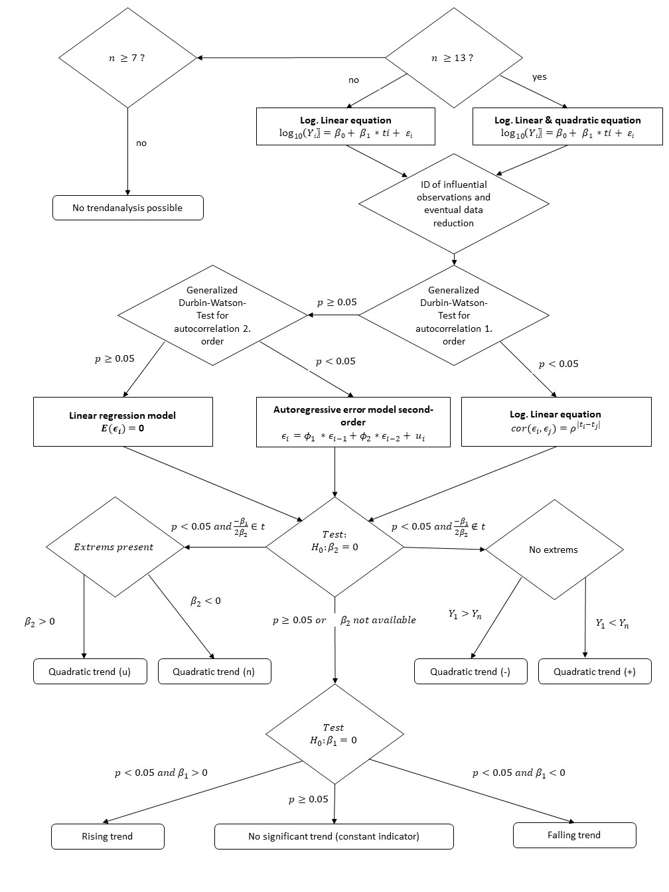

```{r, echo = FALSE, message = FALSE}
knitr::opts_chunk$set(collapse = TRUE,  comment = "#>")
options(tibble.print_min = 6L, tibble.print_max = 6L, digits = 3)
library(trenda)
```
## Overview

The goal of the __trenda__ package is to simplify the analysis of climate change 
related data and is tied to a specific use case where such data is stored in a 
semicolon separated csv-file inside a folder and the first column is a continuous 
time series followed by any number of numeric observations per column to be analysed. 

Generally speaking the function decides whether to use a linear or a 
combination of linear and quadratic model for a Durbin-Watson-Test based on the 
number of observations. Furthermore as we move down the decision tree (Figure 1) 
the results are analysed by evaluating the p-values, creating appropriate 
correlation structures for the autoregressive models
and running a Generalized Least Square model or a simple linear regression before 
eventually running two hypothesis tests to determine the trends for the output. 

This function does not return a value. Rather it stores the results in an 
excel-file inside a subfolder generated by the function including plots for each
observation.


```{r out.width="100%", echo=FALSE}

```

Example 
```{r }

trenda()
```
Figure 1
Data preperation

Decicion tree 
We check
