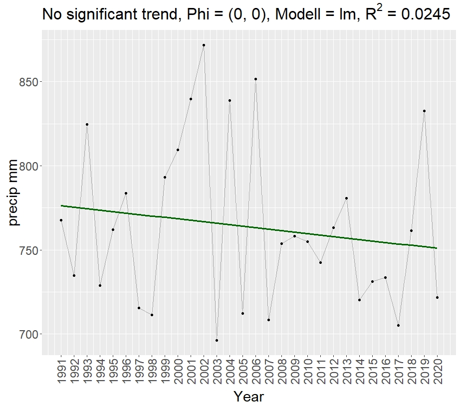
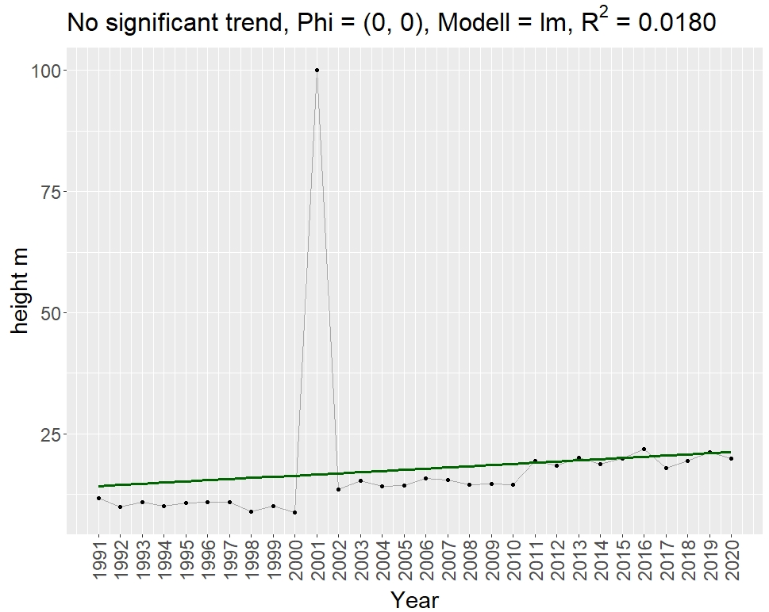
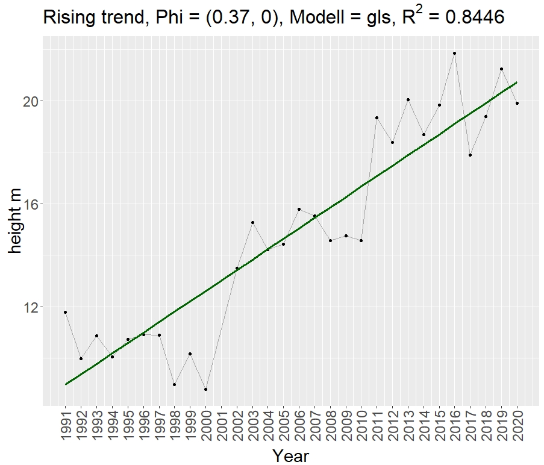

```{r, echo = FALSE, message = FALSE}
knitr::opts_chunk$set(collapse = TRUE,  comment = "#>")
options(tibble.print_min = 6L, tibble.print_max = 6L, digits = 3)
library(trenda)
```
Attachment
  
## Overview

The goal of the __trenda__ package is to provide a robust analysis of climate change
related time series data. The function takes a data frame where the first colum is a 
continous time series of class int followed by any number of colums with numeric observations.

Generally speaking the function decides whether to use a linear or a 
combination of a linear formula with a quadratic term for a Durbin-Watson-Statistics
based on the number of observations. If the DWT detects significant autocorrelation 
autoregressive error models are computed for the correlation structure to be used 
for the gls.
The results are permanently evaluated by testing the p-values until a trend can be determined.


The  `trenda` package has two exported functions: 
  
* `trenda()`
* `trenda_dir()`

`trenda_dir()` was adapted for a specific use case of bulk processing csv-files 
in a given folder. 

  
The following flowchart illustrates how the package is constructed. 
```{r, out.width="100%", echo=FALSE}
knitr::include_graphics("diagram.JPG")
```

## Getting started 


```{r}
```

```{r, eval = FALSE, echo = TRUE}
# load package
library(trenda)
```

Create a random dataset. To illustrate the output better set the second observable
to have a rising trend by combining random data points with different mean value.
```{r, echo = TRUE}
set.seed(1)
rnd_preci <- data.frame(Year = c(1991:2020),
                        precip_mm = rnorm(30, 770, 50),
                        height_m = c(rnorm(10, 10, 1),
                                     100,
                                     rnorm(9, 15, 1),
                                     rnorm(10, 20, 1)))
```

trenda requires the first column to be of type int and the observables to be numeric
```{r}
str(rnd_preci)
```

Run trenda() on rnd_preci
```{r, echo = TRUE}

trenda(rnd_preci, calc_infl_obs = TRUE)
```
The output is a data.frame containing information about the model and relevant 
values to determine the trend. 
  
As we can see, there is "No significant trend" for precip_mm. On the other hand,
as we expected, a trend could be identified for height_m. 

The following graphs confirm our findings and help with visual inspection. 

```{r, out.width="70%", echo = FALSE}

  
#Figure2 precip_mm

  
#Figure3 height_m



```


## Application
Since trenda_dir() was created for a special use-case where data from a folder 
is taken and analysed we have to either create our own folder with data or download
actual climate related data provided by Bosch & Partner from the following repository:

https://github.com/Banui/trenda_example_data/tree/main/in

The folder contains 46 csv files with each having different numbers of observations.

Lets assume the folder is placed in the current working-directory
```{r, eval = FALSE, echo = TRUE}
list.files(path = "./files_folder")
```
Now that everything is in place we can use trenda_dir() to perform the trend analysis 
on every file in the specified folder
```{r, eval = FALSE, echo=TRUE} 
trenda_dir("./files_folder/", log_trans = FALSE, create_dir = TRUE, calc_infl_obs = TRUE)
```
While processing the files and performing the analysis, information about the file
is displayed in the console showing its structure the amount of observables and 
variables. Setting create_dir = TRUE will create a subfolder in the directory given
to data_dir. In this case, two folders are created. They names always start with the current date
followed by _results_standard and _results_standard_obs for the second folder if 
calc_infl_obs = TRUE. Since there could be influential observations in the first iteration
the influential observations are removed from the relevant files and the loop starts over again.
The folder _results_standard_obs will then only contain the files where influential observations
were actually observed. A comparison of the trends can then be performed visually 
or by evaluating the the res_tab_standard or res_tab_standard_obs csv also created 
in each folder. These files contain the same information we saw in the small example before.
If the data provided was there should be a total of 197 graphs produced.
